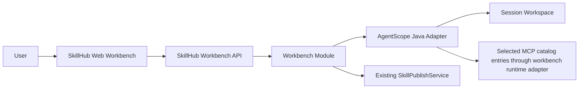

# Implementation Plan: Workbench Agent Runtime

**Branch**: `001-workbench-agent-runtime` | **Date**: 2026-07-30 | **Spec**: `specs/001-workbench-agent-runtime/spec.md`

**Input**: Feature specification from `specs/001-workbench-agent-runtime/spec.md`

## Summary

Build a SkillHub online workbench that prefers AgentScope Java as the runtime kernel candidate for model sessions, session-scoped workspaces, file editing, MCP tools, and HITL approvals. SkillHub wraps that runtime with its own business module for session ownership, source skill import, diff review, package preview, and publishing confirmed output as a new SkillHub skill version through the existing lifecycle. Full implementation is gated by the P3-0 runtime PoC.

## Technical Context

**Language/Version**: Java 21, Spring Boot 3.x; React 19, TypeScript, Vite

**Primary Dependencies**: Existing SkillHub modules; AgentScope Java runtime dependency to be verified in PoC; existing object storage, auth, and publish services

**Storage**: PostgreSQL for workbench business records; object storage or controlled filesystem for workspace package snapshots; Redis only if needed for runtime coordination

**Testing**: Maven unit/integration tests, frontend tests, Playwright workflow tests, image-based Docker Compose acceptance

**Target Platform**: SkillHub server/web deployment, local Docker Compose, Kubernetes-compatible runtime

**Project Type**: Modular web application with Java backend and React frontend

**Performance Goals**: Session page opens within normal SkillHub UI expectations; file diff and package preview handle current SkillHub package limits; event streaming remains responsive for model/tool events

**Constraints**:

- Do not change existing skill package download structure.
- Do not alter existing `skill`, `skill_version`, or `skill_file` tables for MVP.
- Do not bypass existing publish/review/version validation.
- Do not expose MCP credentials to model-visible files, logs, diff, or downloads.
- Use session-scoped workspace isolation for draft editing.

**Scale/Scope**: MVP supports one active model run per workbench session, selected SkillHub MCP bindings, and package sizes within existing SkillHub limits.

## Constitution Check

- SkillHub business governance preserved: PASS.
- Neutral package protocol preserved: PASS.
- Module boundaries respected through a new workbench module: PASS.
- Verification includes integration, UI, and image-based acceptance: PASS.
- Security and audit requirements included: PASS.

## Architecture

### Backend Module

Add a dedicated Maven module:

```text
server/
|-- skillhub-workbench/
|   |-- src/main/java/com/iflytek/skillhub/workbench/
|   |   |-- domain/          # WorkbenchSession, WorkbenchApproval, value objects
|   |   |-- service/         # session orchestration, import, diff, package preview
|   |   |-- runtime/         # AgentRuntimePort and AgentScope Java adapter
|   |   |-- port/            # repository, storage, MCP catalog, and runtime ports
|   |   `-- api/             # app-facing DTOs if module-local
|   `-- src/test/java/
|-- skillhub-app/
|   |-- controller/portal/WorkbenchController.java
|   `-- workbench/adapter/  # app-side adapters for existing app-local services
```

The workbench module owns session, runtime, diff, MCP binding, approval, package preview, and publish orchestration. The app module exposes transport endpoints, resolves the authenticated user, and provides adapters under `server/skillhub-app/src/main/java/com/iflytek/skillhub/workbench/adapter/` for existing app-owned services where those services have not yet been moved behind shared ports.

### Module Dependency Decision

| Module | Responsibility | Dependency Direction |
| --- | --- | --- |
| `skillhub-workbench` | Workbench use cases, runtime port, MCP catalog port, repository ports, package candidate policy | Depends on stable shared/domain/storage contracts only |
| `skillhub-app` | HTTP controllers, auth context composition, web API DTO mapping, adapters for existing app-local services | Depends on `skillhub-workbench`; controller stays transport-only; adapters live under `workbench/adapter` |
| `skillhub-infra` | Persistence implementations for new workbench repositories | May implement workbench repository ports; no web transport logic |
| `skillhub-domain` | Existing skill publish, version, validation, and lifecycle services | Reused by workbench publish orchestration; existing tables remain unchanged |
| `skillhub-storage` | Workspace snapshot and package artifact storage | Reused for baseline/current snapshots and publish inputs |
| `skillhub-mcp` | Existing read-only SkillHub MCP tools such as skill catalog/detail/ref | Optional built-in tool source; not the external MCP catalog runtime adapter |

Repository interfaces are defined in `skillhub-workbench` and implemented in the infrastructure layer, matching the existing domain/infra split. Existing SkillHub lifecycle services are reused through ports/adapters; they are not copied into the new module and are not implemented directly inside controllers.

### Frontend Module

```text
web/src/
|-- pages/workbench/
|-- features/workbench/
|   |-- session-list
|   |-- chat-events
|   |-- file-tree
|   |-- file-editor
|   |-- diff-review
|   |-- mcp-picker
|   `-- publish-panel
`-- api/client.ts
```

Use existing SkillHub navigation, cards, status pills, namespace badges, toasts, and form styles. The workbench is an operational tool surface, not a marketing page.

### Runtime Boundary



Runtime adapter responsibilities:

- Build `RuntimeContext` from SkillHub `userId` and `workbenchSessionId`.
- Configure AgentScope workspace isolation as session-scoped.
- Register allowed file tools with workspace base directory restrictions.
- Translate selected MCP catalog entries into runtime MCP configuration.
- Convert runtime permission requests into SkillHub `WorkbenchApproval` records.
- Stream runtime events to the UI.

MCP boundary:

- Existing `McpCatalogController` and `ContextForgeMcpCatalogClient` provide catalog and server metadata for selectable MCP services.
- Existing `skillhub-mcp` exposes read-only SkillHub tools such as listing skills and fetching skill references; it is not a generic external MCP execution layer.
- The workbench adds a `WorkbenchMcpCatalogPort` and `WorkbenchMcpRuntimeAdapter` to convert selected catalog entries into AgentScope runtime MCP configuration.
- Tool risk classification and approval defaults are workbench policy. Unknown or mutating tools require explicit user approval until a trusted policy says otherwise.

SkillHub business responsibilities:

- Authorize session creation, skill import, MCP selection, and publish.
- Import source version files from SkillHub storage.
- Maintain baseline snapshot and diff.
- Validate package preview.
- Submit new version via existing publish lifecycle.
- Audit all state transitions.

## Data Model

Use new tables only:

- `workbench_session`
- `workbench_session_event`
- `workbench_file_snapshot`
- `workbench_mcp_binding`
- `workbench_tool_approval`
- `workbench_publish_candidate`

No existing table changes are required for the MVP. If implementation later needs metadata on `skill_version`, add it as a new optional association table first and raise a data-impact review before altering existing tables.

## API Surface

Initial web API under `/api/web/workbench`:

- `POST /sessions`
- `GET /sessions/{sessionId}`
- `POST /sessions/{sessionId}/messages`
- `GET /sessions/{sessionId}/events`
- `GET /sessions/{sessionId}/files`
- `GET /sessions/{sessionId}/file?path=...`
- `PUT /sessions/{sessionId}/file?path=...`
- `DELETE /sessions/{sessionId}/file?path=...`
- `GET /sessions/{sessionId}/diff`
- `GET /sessions/{sessionId}/mcp-catalog`
- `POST /sessions/{sessionId}/mcp-bindings`
- `POST /sessions/{sessionId}/approvals/{approvalId}/approve`
- `POST /sessions/{sessionId}/approvals/{approvalId}/reject`
- `POST /sessions/{sessionId}/package-preview`
- `POST /sessions/{sessionId}/publish`

Details are in `contracts/workbench-api.md`.

## Project Structure

### Documentation

```text
specs/001-workbench-agent-runtime/
|-- spec.md
|-- clarifications.md
|-- research.md
|-- plan.md
|-- data-model.md
|-- quickstart.md
|-- contracts/
|   `-- workbench-api.md
|-- checklists/
|   `-- requirements.md
|-- analyze.md
`-- tasks.md
```

### Source Code

```text
server/skillhub-workbench/
server/skillhub-app/src/main/java/com/iflytek/skillhub/controller/portal/
server/skillhub-app/src/main/java/com/iflytek/skillhub/workbench/adapter/
server/skillhub-app/src/main/resources/db/migration/
web/src/features/workbench/
web/src/pages/workbench/
web/src/api/
```

**Structure Decision**: Add a dedicated backend workbench module plus a frontend feature area. Existing skill lifecycle services are reused through explicit ports/adapters, not copied and not embedded in transport controllers.

## Phased Delivery

### Phase P3-0: AgentScope Runtime PoC

- Verify AgentScope Java dependency resolution in the SkillHub Maven build.
- Create a minimal runtime adapter spike with `RuntimeContext(userId, sessionId)`.
- Verify session-scoped workspace path isolation.
- Verify read/write file tools operate only inside workspace.
- Verify a mock MCP mutating tool produces an approval-required event.

### Phase P3-1: Backend Workbench Session and Workspace

- Add workbench module, Flyway migrations for new tables, repositories, and session lifecycle.
- Implement source skill version import into workspace and immutable baseline snapshot.
- Implement file list/read/write/delete and diff APIs.

### Phase P3-2: Frontend Workbench UI

- Add session creation, skill/version selector, chat/event panel, file tree, file editor, diff review, and publish panel.
- Align visual styles with existing SkillHub skill detail and expert package pages.

### Phase P3-3: MCP Selection and HITL

- Add session-scoped MCP selection from MCP catalog entries through the workbench runtime adapter.
- Add approval queue UI and approve/reject endpoints.
- Audit tool-call decisions.

### Phase P3-4: Package Preview and Publish

- Convert confirmed workspace into package entries.
- Apply a workbench package allowlist/exclusion pass before existing validation.
- Exclude runtime artifacts such as session logs, memory files, `AGENTS.md`, temporary tool outputs, and hidden runtime directories.
- Validate the remaining neutral skill package files with existing package policy.
- Publish through existing SkillHub lifecycle as a new version.

### Phase P3-5: Acceptance and Release Readiness

- Run backend unit and integration suites.
- Run frontend unit and Playwright flows.
- Build server/web images.
- Run image-based Docker Compose acceptance covering create, update, MCP approval, package preview, publish, and download.

## Migration and Compatibility

- Add new workbench tables only.
- Do not modify existing skill tables in MVP.
- Existing published skills, downloads, CLI behavior, and package structure remain compatible.
- If AgentScope runtime requires a separate service or sandbox sidecar, document and review deployment impact before implementation.

## Security and Audit

- User owns their workbench sessions.
- Namespace membership and skill ownership are rechecked on import and publish.
- File paths are normalized and restricted to the session workspace.
- MCP credentials are resolved server-side and excluded from workspace files.
- Approval-required tools block until user decision.
- Audit records are required for session and publish-critical actions.

## Verification Plan

- Unit tests for state transitions, path policy, package artifact filtering, and diff generation.
- Integration tests with PostgreSQL/object storage for session creation, source import, preview, and publish.
- Runtime PoC tests for AgentScope context, workspace, file tools, and mock MCP approval.
- Frontend tests for session UI, file editor, diff panel, approval prompt, and publish flow.
- Playwright visual and functional checks at desktop and laptop widths.
- Docker image acceptance using the built server/web images and service endpoints.

## Risks and Fallbacks

| Risk | Mitigation | Fallback |
| --- | --- | --- |
| AgentScope Java dependency or API mismatch | PoC before implementation | Wrap behind `AgentRuntimePort`; use mock runtime until compatible version is selected |
| Sandbox deployment complexity | Start with adapter boundary and local controlled workspace for dev; production review for sandbox | Delay shell/tool execution, allow model text/file edits only |
| MCP approval mismatch | Use SkillHub approval records as source of truth | Disable mutating MCP tools in MVP |
| Package contamination by runtime files | Explicit package allowlist and preview tests | Block publish on unknown root files |
